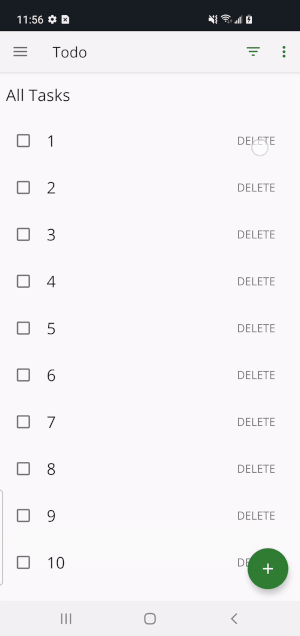

# Inline delete w/ undo (added feature)

Delete items from a list, allowing the user to "undo" within 3 seconds (using Coroutines).

[Download the APK](https://github.com/august-gruneisen/architecture-samples/raw/delete-task-feature/.github/support-files/app-prod-debug.apk) to test.

See [core logic](https://github.com/august-gruneisen/architecture-samples/blob/67b760c2bb6a34bfe5a050b6e29ad20850db8c54/app/src/main/java/com/example/android/architecture/blueprints/todoapp/TaskDeleter.kt)  and [unit tests](https://github.com/august-gruneisen/architecture-samples/blob/67b760c2bb6a34bfe5a050b6e29ad20850db8c54/app/src/test/java/com/example/android/architecture/blueprints/todoapp/TaskDeleterTest.kt).

  
	

### Highlights:
1. Survives configuration changes
2. Doesn't block the main thread
3. Supports any number of concurrent deletions
4. Logic is encapsulated to simplify the view model
5. Unit tested

__Noteworthy:__ The `TaskDeleter` class allows platform-specific behavior (i.e. updating local storage, updating the view layer) to be passed in as [parameters](https://github.com/august-gruneisen/architecture-samples/blob/67b760c2bb6a34bfe5a050b6e29ad20850db8c54/app/src/main/java/com/example/android/architecture/blueprints/todoapp/TaskDeleter.kt#L35). Because of this, it would scale well to a multiplatform project with a shared codebase (KMM).